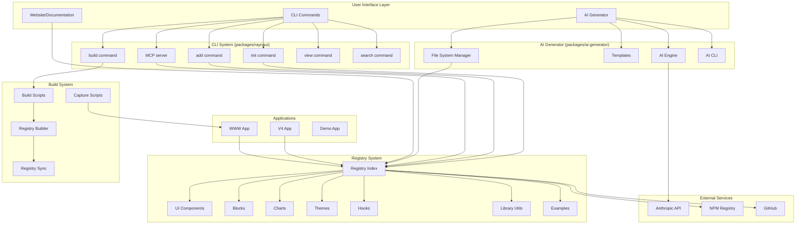
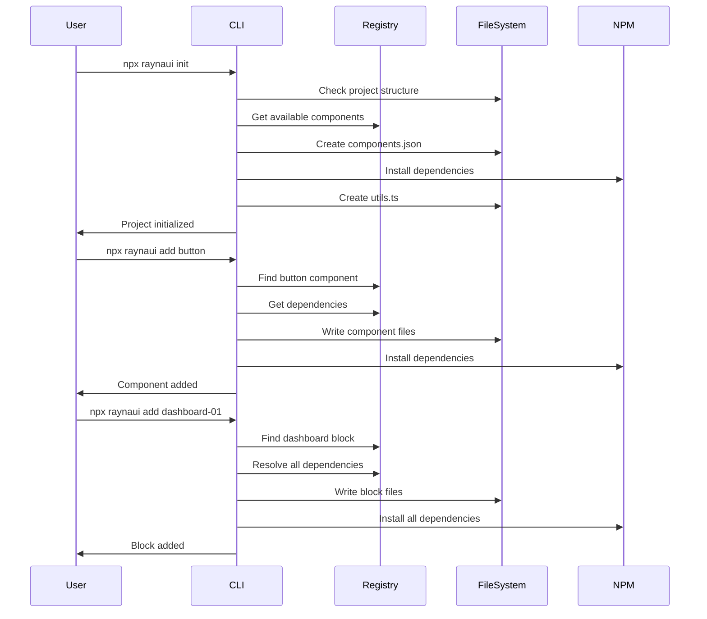
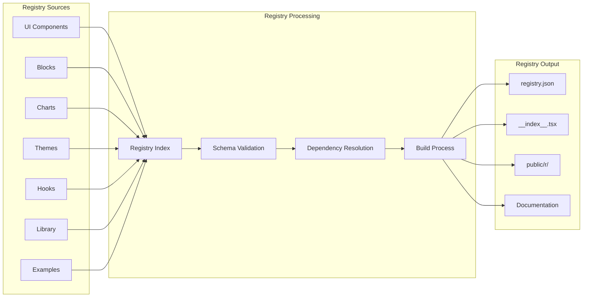
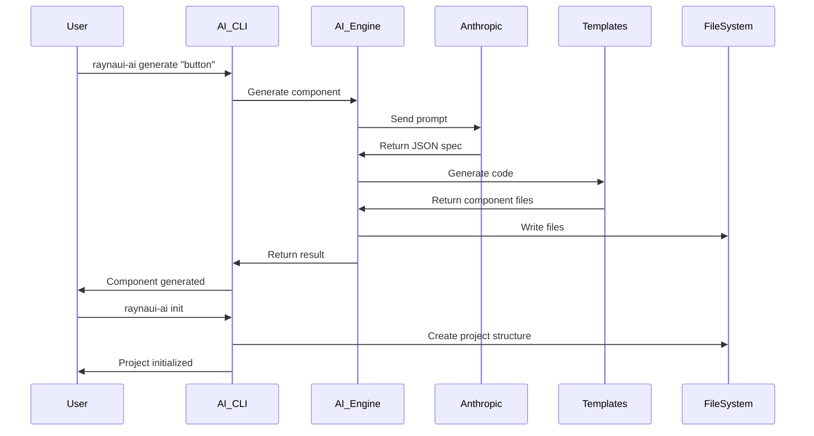
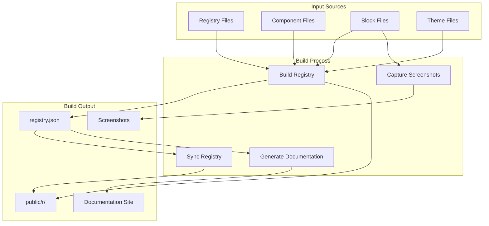
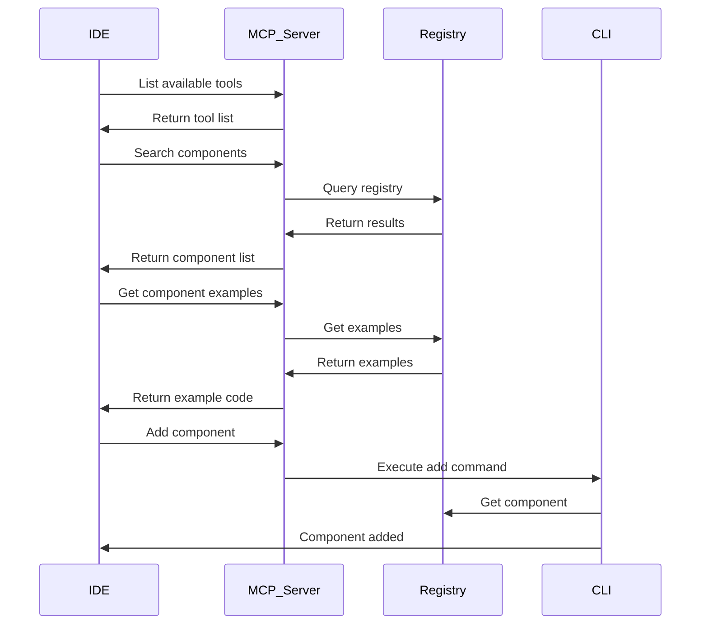
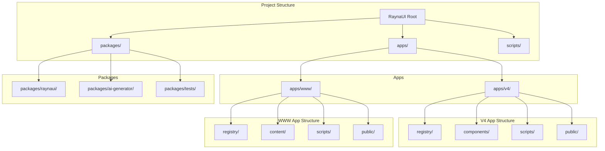

# RaynaUI Architecture Flow Diagram

## 🏗️ Complete System Architecture

## 🔄 Detailed Component Flow

### 1. CLI Command Flow

### 2. Registry System Flow

### 3. AI Generator Flow

### 4. Build System Flow

### 5. Component Collection Structure

```mermaid
graph TB
    subgraph "Component Types"
        UI[UI Components]
        BLOCKS[Blocks]
        CHARTS[Charts]
        THEMES[Themes]
        HOOKS[Hooks]
        LIB[Library]
        EXAMPLES[Examples]
    end

    subgraph "UI Components"
        BUTTON[Button]
        CARD[Card]
        INPUT[Input]
        MODAL[Modal]
        NAV[Navigation]
        FORM[Form]
    end

    subgraph "Blocks"
        DASHBOARD[Dashboard]
        LOGIN[Login]
        PROFILE[Profile]
        SETTINGS[Settings]
        ANALYTICS[Analytics]
    end

    subgraph "Charts"
        LINE[Line Chart]
        BAR[Bar Chart]
        PIE[Pie Chart]
        AREA[Area Chart]
        SCATTER[Scatter Plot]
    end

    subgraph "Themes"
        NEW_YORK[New York]
        DEFAULT[Default]
        CUSTOM[Custom]
    end

    UI --> BUTTON
    UI --> CARD
    UI --> INPUT
    UI --> MODAL
    UI --> NAV
    UI --> FORM

    BLOCKS --> DASHBOARD
    BLOCKS --> LOGIN
    BLOCKS --> PROFILE
    BLOCKS --> SETTINGS
    BLOCKS --> ANALYTICS

    CHARTS --> LINE
    CHARTS --> BAR
    CHARTS --> PIE
    CHARTS --> AREA
    CHARTS --> SCATTER

    THEMES --> NEW_YORK
    THEMES --> DEFAULT
    THEMES --> CUSTOM
```

### 6. MCP (Model Context Protocol) Integration

### 7. File Structure and Dependencies

## 🔧 Key Integration Points

### 1. CLI ↔ Registry Integration
- CLI reads from registry to get component definitions
- CLI writes to registry to add new components
- Registry provides dependency resolution
- Registry handles file path mapping

### 2. AI Generator ↔ Registry Integration
- AI Generator uses registry patterns for component generation
- Generated components follow registry schema
- AI Generator can add components to registry
- Registry provides training data for AI

### 3. Build System ↔ Registry Integration
- Build system processes registry files
- Build system generates public registry
- Build system captures screenshots
- Build system syncs between apps

### 4. MCP ↔ Registry Integration
- MCP server provides registry access to IDEs
- MCP server enables AI-assisted development
- MCP server handles registry queries
- MCP server manages component installation

### 5. Website ↔ Registry Integration
- Website displays registry contents
- Website provides component documentation
- Website enables component preview
- Website manages component installation

## 🚀 Data Flow Summary

1. **Component Creation**: Components are created in registry files
2. **Registry Processing**: Build system processes registry and generates outputs
3. **CLI Access**: CLI reads registry to provide component installation
4. **AI Generation**: AI uses registry patterns to generate new components
5. **Website Display**: Website displays registry contents and documentation
6. **MCP Integration**: MCP provides registry access to development tools
7. **User Installation**: Users install components via CLI or website
8. **Dependency Management**: System manages all dependencies automatically

This architecture creates a complete ecosystem where components can be created, managed, distributed, and used seamlessly across different tools and platforms. 